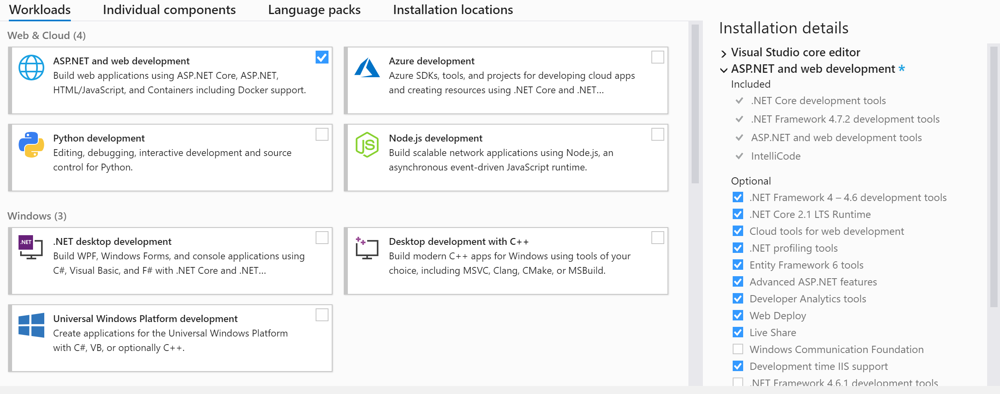

# ELI

## Requirements

### Windows

 - .NET Core 2.2 SDK
 - Visual Studio 2017 (version 16+)

### Mac

 - .NET Core 2.2 SDK
 - Visual Studio for Mac (version 7.5+)

---

## Development notes

We are trying to make this project one that can be worked on by folks using Mac or Windows, so please be mindful that you are not checking in Windows-specific config files that do not work on a Mac.

---

## Installation and Setup

### Windows Setup

#### Using local IIS on Windows to serve project without publishing

The project can be run from within Visual Studio using IIS Express.  However, depending on your development setup/work process, you may want to serve the project via your local IIS.  By default in .NET Core, this requires publishing, then setting up the project in IIS which is...not ideal.  Ideally, one wants to just build the project, then be able to view the app at the standard location for your local IIS setup. Good news - it's possible!

1. Install Requirements
    - [Install Visual Studio 2017 (version 15.7+)](https://visualstudio.microsoft.com/)
    - [Install .NET Core SDK 2.2](https://dotnet.microsoft.com/download/dotnet-core/2.2)
        - Open a command prompt and type `dotnet --list-sdks` to ensure the SDK was properly installed. Below is an example of a successful install:
          ```
          C:\Users\user.name>dotnet --list-sdks
          2.2.207 [C:\Program Files\dotnet\sdk]
          ```

2. Install the **ASP.NET and web development module**.
    - Open the Visual Studio Installer if it's not already open. Select "Modify" for the Visual Studio instance you're using if you skipped package installation
    - Select `ASP.NET and web development` under Workloads (Web & Cloud) and click add. Close the window

3. Enable IIS.
    - Go to the Control Panel > Programs > Programs & Features > Turn Windows features on or off
    - Select the `Internet Information Services` check box, and click OK
        

4. Enable Development Time IIS for ASP.NET in the Visual Studio Installer.
    - Open the Visual Studio Installer
    - On the right side under Installation Details customize the module by selecting `Development time IIS support`. Click the modify button and this will install the module
    - If you don't see `Development time IIS support`, restart the Visual Studio Installer

      

5. Add a web.config file to the base of the ELI project folder, `C:\...\eli\ELI\web.config`. 

    - To add a web.config file, right click on the ELI project in the Solution Explorer in Visual Studio then > Add > New Item > Under ASP.NET Core, select Web Configuration File > Click Add at the bottom
        
    - Replace the file with the example below. Update the arguments path to point to the location of the ELI project in your local ELI solution folder
    - Make sure that the processPath attribute has the correct path for dotnet. It typically installs in `C:\Program Files\dotnet\dotnet.exe`

      ```xml
      <?xml version="1.0" encoding="utf-8"?>
      <configuration>

        <!-- To customize the asp.net core module uncomment and edit the following section. 
      For more info see https://go.microsoft.com/fwlink/?linkid=838655 -->
      
        <system.webServer>
          <handlers>
            <add name="aspNetCore" path="*" verb="*" modules="AspNetCoreModule" resourceType="Unspecified" />
          </handlers>
          <!-- Check dotnet installation and update arguments path here -->
          <aspNetCore processPath="C:\Program Files\dotnet\dotnet.exe"
                    arguments="run --project C:\Path\to\your\eli\ELI" 
                    stdoutLogEnabled="true" stdoutLogFile=".\logs\stdout" forwardWindowsAuthToken="false">
              <environmentVariables>
                <environmentVariable name="ASPNETCORE_ENVIRONMENT" value="Development" />
              </environmentVariables>
          </aspNetCore>
        </system.webServer>
      
      </configuration>
      ```

6. Set up the app in IIS.
    - Open up the Internet Information Services (IIS) manager
    - On the left side under Connections, expand your computer's folder
    - Click on Application Pools and to the right side under Actions, click on 'Add Application Pool'
    - Set the following and click OK:
        - **Name:** ELI
        - **.NET CLR version:** No Managed Code
        - **Managed pipleine mode:** Integrated
          
    - Right click on the ELI Application Pool and select **Advanced Settings**. Scroll down to the Process Model, and under the **Identity** attribute, click the 3 dots that appear and sign in as a **Custom Account** with your campus username and password. Click **OK**.
    - On the left side under Connections, click on **Sites**, and to the right side under Actions, click on **Add Website**
    - Set the following and click OK:
        - **Content Directory**
            - **Site Name**: ELI
            - **Application Pool**: ELI
            - **Physical Path**: C:\Users\user.name\...\eli\ELI
            - Click **Connect as...** and log in as a specific user with your campus username and password.
        - Test that you are able to authenticate and view the ELI folder by clicking on **Test Settings...**. Both settings should have a green checkmark if successful. If not, check that you have permission to read the ELI folder as an admin.
        - **Binding**
            - **Type**: http
            - **IP Address**: All unassigned
            - **Port**: (Insert any port number that is not taken) ex: 800
            - **Host name**: localhost
      - The end result will look similar to this:
      
7. Set up the Nlog Config
    - In Visual Studio, open up the ELI solution. Rename the `example-nlog.config` file to `nlog.config`.
    - Change the settings on lines **23** and **24** to the following and save:
    ```xml
      <variable name="dbServer" value="<Insert database URL>"/>
      <variable name="dbName" value="Elmah"/>
    ```
8. Set up the appsettings.Development.json config
    - Rename the `appsettings.Development.json.example` file to `appsettings.Development.json`.
    - Change the settings on line **10** to the following and save:
    ```json
    "ELIDatabase": "Data Source=<Insert database URL>;Initial Catalog=ELI;Integrated Security=True;"
    ```
    - **Make sure to never commit the newly updated Development file to Github.**
9. In Visual Studio, run the program by clicking **IIS Express** under debug. The program should open up and be running in the browser.

## Globals 4 Set Up

Temporarily, we will be connecting Globals 4/Bootstrap 4 files into ELI in the wwwroot folder. This will be changed as we upgrade Globals 4 into ELI completely.

1. Clone down globals and checkout into `dev` and then we will set up the files. 
    - In a terminal, change directory into the globals folder. Run `npm install`. Make sure gulp is installed: `npm install -g gulp`. 
    - Run `cd globals/src/4/` and then run `gulp dev`
2. In Visual Studio, under the ELI wwwroot folder, right click and **add a folder** called `g`.
3. Under `g`, add a `4` folder, and then under the `4` folder, add a `c`, `f`, `i`, and `j` folder. We will be copying the globals files into these folders, much like the original globals.
4. Right click each folder in Visual Studio, and **add an existing file** for each corresponding folder from `globals/g/4`. Choose the following files below to add from the globals project folder, such as `globals/g/4/c`:

    

**Note:** In the following file, `Pages/Shared/_Layout.cshtml`, the following pattern `~/g/4/...` is used to link the globals files in HTML.

#### More information

 - [https://stackoverflow.com/a/50286082/891018](https://stackoverflow.com/a/50286082/891018)
 - [https://blogs.msdn.microsoft.com/webdev/2017/07/13/development-time-iis-support-for-asp-net-core-applications/](https://blogs.msdn.microsoft.com/webdev/2017/07/13/development-time-iis-support-for-asp-net-core-applications/)

### Using integrated authentication to connect to database (for development on Windows with IIS)

You can use integrated authentication with .NET Core projects to authenticate and connect to a database.  As with other projects, you will want to set the identity of the application pool to a user that has access to the database (your account or a service account).  You may also need to provide this user read access to the directory where your `dotnet.exe` is (likely `C:\Program Files\dotnet\`).

Any updates you make to the connection string should be done in an environment specific appsettings file like `appsettings.Development.json` _not_ in the main `appsettings.json` and should _not_ be committed to the repository. Refer to docs for a sample file.

### Database authentication for Mac users

Mac users will need to use the ELI SQL user, rather than domain service account, to connect to the database. You will need to update the connection string in `appsettings.Development.json`. Changes should of course _not_ be committed to the repo.

Example connection string:

```
"ConnectionStrings": {
    "ELIDatabase": "Server=xxx.bellevuecollege.edu;Database=ELI;User Id=xxx;Password=xxx"
  }
```

## Documentation/help resources

 - [https://docs.microsoft.com/en-us/aspnet/core/data/ef-rp/?view=aspnetcore-2.1](ASP.NET Core Razor Pages with EF Core - tutorial series)
 - [https://www.learnrazorpages.com/](Learn Razor Pages)
 - [https://docs.microsoft.com/en-us/aspnet/core/mvc/models/model-binding?view=aspnetcore-2.1](Model binding and validation)
 - [https://docs.microsoft.com/en-us/aspnet/core/host-and-deploy/web-farm?view=aspnetcore-2.1](Host ASP.NET Core in a web farm)
 - [https://docs.microsoft.com/en-us/xamarin/xamarin-forms/enterprise-application-patterns/mvvm](The Model-View-ViewModel pattern)
 - [https://docs.microsoft.com/en-us/aspnet/core/host-and-deploy/proxy-load-balancer?view=aspnetcore-2.1](Configuring ASP.NET to work with proxies and load balancers)
 - [https://docs.microsoft.com/en-us/aspnet/core/security/authorization/iauthorizationpolicyprovider?view=aspnetcore-2.1](Custom authorization policy providers)
